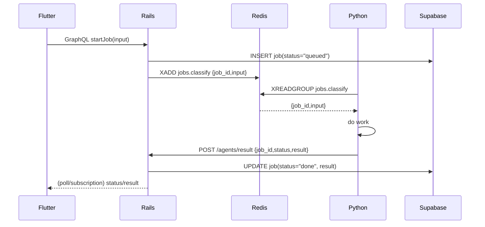

# VTHacks 2025-2026 Backend

BlahBlahBlah

## GraphQL Documentation

Hello World

## Architecture

```mermaid
sequenceDiagram
  participant Flutter
  participant Rails
  participant Redis
  participant Python

  Flutter->>Rails: GraphQL startJob(input)
  Rails->>Supabase: INSERT job(status="queued")
  Rails->>Redis: XADD jobs.classify {job_id,input}
  Python->>Redis: XREADGROUP jobs.classify
  Redis-->>Python: {job_id,input}
  Python->>Python: do work
  Python->>Rails: POST /agents/result {job_id,status,result}
  Rails->>Supabase: UPDATE job(status="done", result)
  Rails-->>Flutter: (poll/subscription) status/result
```
