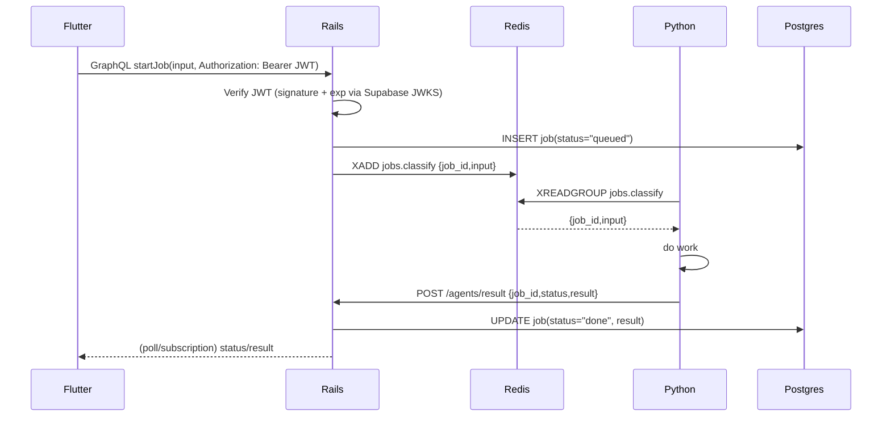

# VTHacks 2025-2026 Backend

BlahBlahBlah

## GraphQL Documentation

Hello World

## Architecture



## Run locally (development)

This project includes a `docker-compose.dev.yml` that builds and runs the Rails and agent services together with Redis for local development. There is a developer env file at `backend/.env.dev` that provides sane defaults (including a sqlite fallback `DATABASE_URL`) for local development.

Quick start (from the `backend/` folder):

```bash
# build and run the dev stack (Rails, Python agent, Redis)
cd backend/deploy
docker compose -f docker-compose.dev.yml up --build
```

Notes:

- We use `backend/.env.dev` as the env_file for the compose dev stack. It contains a development `DATABASE_URL` (sqlite fallback) and Redis URLs. If you modify `.env.dev`, make sure it contains the variables the services expect (notably `DATABASE_URL`).
- If you prefer to run Rails locally (not in Docker), ensure you either set `RAILS_ENV=development` or export a `DATABASE_URL` before starting Rails to avoid a KeyError from `config/database.yml` which expects `DATABASE_URL` in production/default configurations.

Useful commands (local troubleshooting):

```bash
# Run rails server locally in development mode
RAILS_ENV=development bin/rails server

# If you need to set DATABASE_URL to the sqlite fallback used in the dev compose file:
export DATABASE_URL=sqlite3:/absolute/path/to/backend/railsApp/storage/fallback.sqlite3

# Run RuboCop (use the project's bundler gems if available)
cd railsApp
# Prefer bundle exec if you have bundler installed per Gemfile.lock
bundle exec rubocop || rubocop
```

Troubleshooting

- If `docker compose up --build` fails during `bundle install` with native extension errors (e.g. psych/yaml), the Rails Dockerfile has been updated to install `libyaml-dev` so re-run the build. If you see missing system libraries for other gems, install the matching `-dev` packages in the Dockerfile or run the stack via the `deploy` compose file which already contains recommended packages.
- If RuboCop in CI fails with layout complaints, run `bundle exec rubocop` locally to see file/line numbers. Common quick fixes are adding a space after `#` comments, removing trailing whitespace, and ensuring files end with a single newline.

If you want me to add a Makefile or convenient scripts for these commands, tell me which commands you run most often and I will add them.
